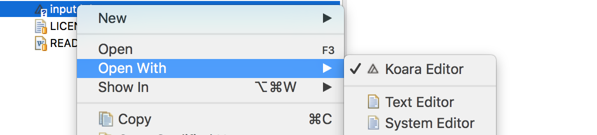

> Koara support for Eclipse

## Installation
- Update site: 

## Features
### Koara Editor
Open .kd files in a dedicated Koara Editor

## Community
- Mailing Lists: [archive](http://groups.google.com/group/koara-users/topics), [subscribe](mailto:koara-users+subscribe@googlegroups.com), [unsubscribe](mailto:koara-users+unsubscribe@googlegroups.com)
- Projects: [http://koara.io/projects.html](http://koara.io/projects)